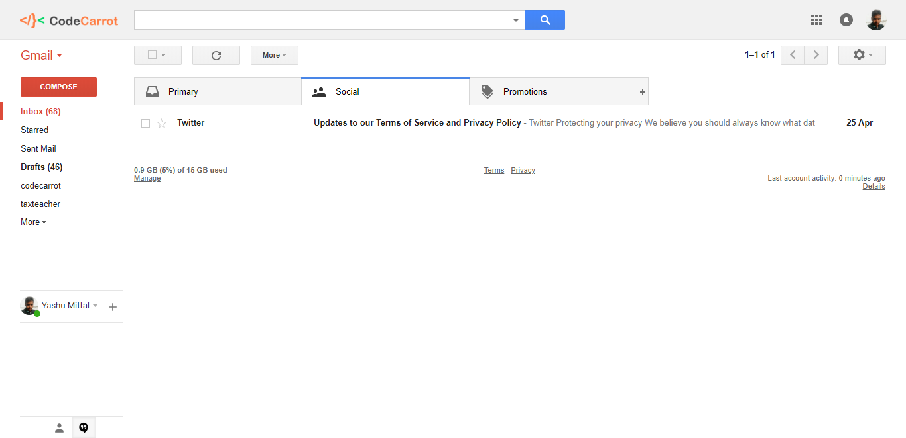

# What is Visual Design?

We refer to an application's visual design exclusively as its style. We use [gestalt principles](https://blog.codecarrot.net/using-gestalt-principles-for-natural-interactions) to communicate and bring order to those ideas in our applications.

Those fundamentals include, among others:

- Alignment (often achieved with grids)
- Emphasis (often achieved with size, position, color)
- Consistency (buttons, links, headers typically look alike)
- Whitespace (elegant, timeless, gives eye a rest)

Successful visual designs typically don't draw attention to themselves. The content will be front-and-center. The workflows through the site will be obvious. Resist the temptation to aim for a design that is "memorable" or a design that "pops."

Successful designs are usable. Consider Google's visual design:

Everything's on a grid. The "Search" and "Compose" buttons are emphasized over other calls to action with color. The unread messages are emphasized over other messages with a bold font weight.

Everything's on a grid. There is lots of whitespace (especially with [AdBlock](https://chrome.google.com/webstore/detail/adblock/gighmmpiobklfepjocnamgkkbiglidom)). Search interface is consistent with Gmail.

Grids. Whitespace. Consistent search box, search filters, search results.

Grids. Whitespace. Emphasis on searching and price information.

We say "visual design" instead of "graphic design" because typically graphics aren't called for in our applications. Instead, we rely on these principles and excellent [typography](https://codecarrot.gitbook.io/guides/style/typography), using high-quality typefaces from [Typekit](http://typekit.com/) and [typography.com](http://www.typography.com/).
